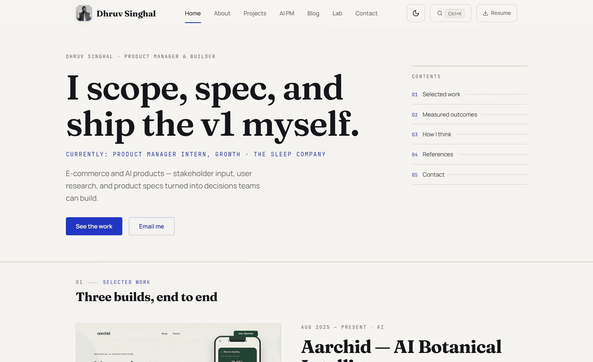

# dhruvsinghal.codes

A portfolio built like a product: case studies with the decisions left in, not a
grid of screenshots.

[](https://github.com/atavisticrystal6888/Portfolio-v4/actions/workflows/ci.yml)
[](https://dhruvsinghal.codes)

<picture>
  <source media="(prefers-color-scheme: dark)" srcset="docs/hero-dark.png">
  
</picture>

## What this is

My personal site — **[dhruvsinghal.codes](https://dhruvsinghal.codes)** — and the
place I use to argue that a product person should be able to ship the v1. It is a
Next.js 16 / React 19 app whose real payload is content: 12 projects and 17
long-form case studies authored in MDX, each written as a dossier (the problem,
the decision, what it cost, what the numbers did) rather than a gallery caption.

The site is its own case study. Reading order, curation, and depth are the
product decisions; the code exists to serve them.

## Quick start

```bash
npm install
npm run dev          # http://localhost:3000
```

That is the whole loop — content lives in [`content/`](./content) as JSON and
MDX, so most changes are a file edit and a hot reload. To produce a production
build locally:

```bash
npm run build && npm run start
```

## Notable engineering decisions

**Content is data, not markup.** [`content/projects.json`](./content) drives every
project surface, and case studies are MDX compiled through `@next/mdx`. Adding a
project is one JSON entry plus one `.mdx` file — no component work, no route
changes. Drafts live in `content/drafts/` and are deliberately excluded from the
build, so unfinished writing can sit in the repo without leaking to production.

**Accessibility and SEO are enforced, not aspirational.** Lighthouse CI runs on
every push across 12 routes with `accessibility ≥ 90` and `seo ≥ 95` as **hard
failures** (performance, best-practices, and the Core Web Vitals budgets — FCP
< 1.8 s, LCP < 2.5 s, CLS < 0.1 — are warnings). Config in
[`lighthouserc.json`](./lighthouserc.json). A separate Playwright job runs axe
checks against the real pages.

**Two themes, one token layer.** A light "working-paper" and a dark
"night-blueprint" mode are defined entirely in
[`src/styles/tokens.css`](./src/styles) and applied via a `data-theme` attribute
that an inline script sets from `localStorage` *before first paint*, so there is
no flash of the wrong theme on load. Both palettes are contrast-checked to WCAG AA.

**The résumé ships as a file.** [`public/resume/`](./public/resume) serves one
PDF. `npm run resume:pdf` can render a markdown source in `content/resume/`
through headless Chromium, but those sources are kept out of the public repo,
so the script only runs on the author's machine.

## Testing

90 test cases, split by what they can actually catch:

| Suite | Command | Covers |
|---|---|---|
| Vitest (44 cases) | `npm test` | Content loading, parsing, and lib logic |
| Playwright e2e (46 cases, incl. axe a11y) | `npm run test:e2e` | Real navigation, rendering, and accessibility on built pages |

CI ([`.github/workflows/ci.yml`](./.github/workflows/ci.yml)) runs four jobs in
sequence: lint + unit → Next.js build → Playwright (chromium and mobile-chrome,
against the built artifact) → Lighthouse CI.

## Repo layout

| Path | What it is |
|---|---|
| [`src/`](./src) | App Router pages, components, hooks, lib, styles |
| [`content/`](./content) | `projects.json`, case studies (MDX), blog, résumé sources, lab ideas |
| [`public/`](./public) | Static assets, fonts, project imagery, generated résumé PDF |
| [`scripts/`](./scripts) | Utilities — currently the résumé PDF generator |
| [`tests/`](./tests) | `unit/` (Vitest), `e2e/` and `accessibility/` (Playwright) |
| [`docs/`](./docs) | Design notes and the README imagery |

## Working on this repo

- [`DEPLOYMENT.md`](./DEPLOYMENT.md) — Vercel setup and deploy details.
- [`DISABLED-INTERACTIVES.md`](./DISABLED-INTERACTIVES.md) — four interactive
  extras that remain in the tree but are deliberately not mounted, and why.
- `content/drafts/` is not read by the build. Nothing in it ships.
- Portfolio iterations v1–v3 were removed from the working tree in August 2026.
  They remain in git history and on the `archive/pre-refresh-2026-08` branch.

---

Built by [Dhruv Singhal](https://dhruvsinghal.codes) · [LinkedIn](https://linkedin.com/in/dhruvsinghal6888) · [dhruvsinghal6888@gmail.com](mailto:dhruvsinghal6888@gmail.com)
