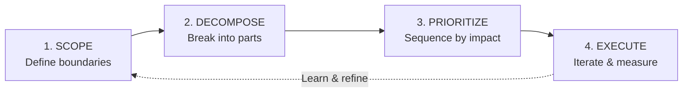

## Why Ambiguity Is the PM's Job

If you've ever been in a meeting where someone says "we need to improve the user experience" and the room nods along — you've encountered unstructured ambiguity. Everyone agrees something needs to happen. No one agrees on what, why, or how to know if it worked.

Here's the thing: **ambiguity is the PM's primary raw material.** Engineers work with code. Designers work with interfaces. PMs work with ambiguity. Our job is to take messy, contradictory, incomplete information and turn it into a clear plan that a team can execute.

But most PMs don't have a repeatable system for this. They rely on experience, pattern matching, and (secretly) hoping someone else in the room will add structure. Over three years of navigating ambiguous problems — from launching new features at Omniful to building analytics frameworks for Odena — I've developed a 4-step framework that works reliably.

## The 4-Step Framework

The framework is intentionally simple. Complex frameworks don't get used. This one does.

### Step 1: Scope — Define the Boundaries

Every ambiguous problem is infinite until you draw a box around it. Scoping isn't about finding the answer — it's about defining which answers you're looking for.

Ask three questions:

- **What are we NOT solving?** This is more useful than "what are we solving" because it eliminates the infinite space of possible directions.
- **Who is the decision for?** "Improve user experience" for power users is a completely different problem than for new signups.
- **What does success look like in 90 days?** If you can't describe a measurable outcome, the problem isn't scoped yet.

At Omniful, "improve warehouse operations" was the initial brief. After scoping, it became: "Reduce pick-to-ship time by 20% for warehouses processing 500+ orders/day within Q2." That's a problem a team can solve.

### Step 2: Decompose — Break It Into Parts

Once scoped, break the problem into independent sub-problems. I use a MECE-ish approach (Mutually Exclusive, Collectively Exhaustive — but I don't stress about perfection).

For the warehouse example:

- **Discovery:** What's causing the current pick-to-ship delays?
- **Design:** What workflows can reduce movement/search time?
- **Technical:** Can we optimize the routing algorithm?
- **Operational:** Are there process changes (no code needed) that would help?

The key insight: each sub-problem can be worked on independently. Discovery can happen in parallel with technical research. You don't need to solve them sequentially.

### Step 3: Prioritize — Sequence by Impact

Not all sub-problems are equal. Prioritize on two axes:

- **Impact:** How much does solving this move the needle on the 90-day goal?
- **Confidence:** How certain are we about the solution approach?

High-impact, high-confidence items go first — they're quick wins that build momentum. High-impact, low-confidence items need experiments before commitment. Low-impact items get deprioritized regardless of confidence.

> **The prioritization trap:** Most teams prioritize by effort, not impact. They solve the easy things first and never get to the hard, important ones. Prioritize by the value of the answer, not the ease of finding it.

### Step 4: Execute — Iterate and Measure

Execution isn't "go build it." It's a cycle:

1. Pick the top-priority sub-problem
2. Define a hypothesis: "If we [action], then [metric] will [change] by [amount]"
3. Build the minimum thing needed to test the hypothesis
4. Measure the result
5. Update your understanding and re-prioritize

This is where most frameworks stop, but the arrow back to Step 1 (in the diagram above) is critical. Every execution cycle teaches you something that may change how you scoped the problem. The framework is a loop, not a line.

## Real Example: Churn at a SaaS Product

Here's how I applied this at Odena when faced with "we're losing too many users":

**Scope:** We narrowed it to "reduce churn among users in their first 60 days from 32% to below 25% by end of Q3." We explicitly excluded enterprise accounts (different churn dynamics) and users who never completed onboarding (different problem).

**Decompose:** Three sub-problems emerged: (1) users who churned after one session, (2) users who were active for 2-3 weeks then stopped, (3) users who downgraded to free tier. Each had different root causes.

**Prioritize:** Category 2 was the biggest group (47% of churned users) with the highest recovery potential. Category 1 was likely an onboarding issue (separate initiative). Category 3 was a pricing issue (outside our scope).

**Execute:** We hypothesized that 2-3 week users churned because they didn't discover the key feature that makes the product sticky. We built a targeted in-app nudge sequence. Result: 15% reduction in that cohort's churn within 6 weeks.

## Common Pitfalls

Having used this framework for two years, here are the mistakes I see (and sometimes still make):

- **Scope too broad:** "Improve retention" is not a scoped problem. Neither is "reduce churn." Get specific about who, what, by how much, by when.
- **Decompose into tasks, not sub-problems:** "Build a notification system" is a task. "Understand why users forget to return" is a sub-problem. Decompose into problems, not solutions.
- **Prioritize by consensus:** The loudest stakeholder's pet project isn't necessarily the highest-impact item. Use data (even rough data) over opinions.
- **Execute without measuring:** If you don't define what success looks like before you build, you can't tell if you succeeded after. Define the metric and threshold before writing a line of code.
- **Skip the feedback loop:** The framework is a cycle. After executing, go back and re-scope. The problem has changed — your understanding of it should too.

## Making It Yours

Frameworks are tools, not religions. Take what works from this and adapt it. The core principle is simple: **structure your approach to ambiguity before diving into solutions.**

The best PMs I know all have some version of this — a repeatable process for taking messy inputs and producing clear outputs. It doesn't have to be this exact framework. But it should be something. Intuition is real, but it's not scalable. A framework is.

And if you're in an interview and someone asks "how would you approach [ambiguous problem]?" — this framework is your answer. Walk them through it with a real example, and you'll stand out from 90% of candidates who jump straight to solutions.
